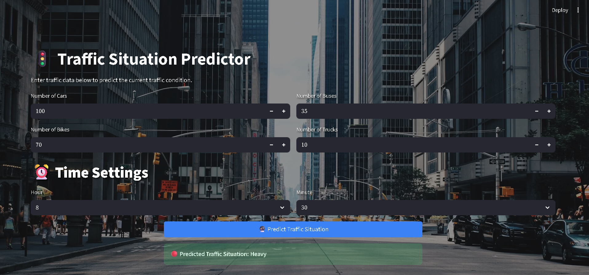
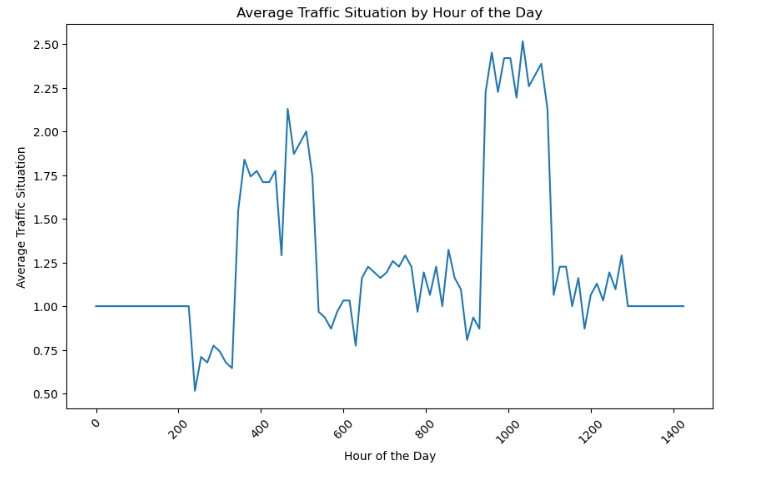
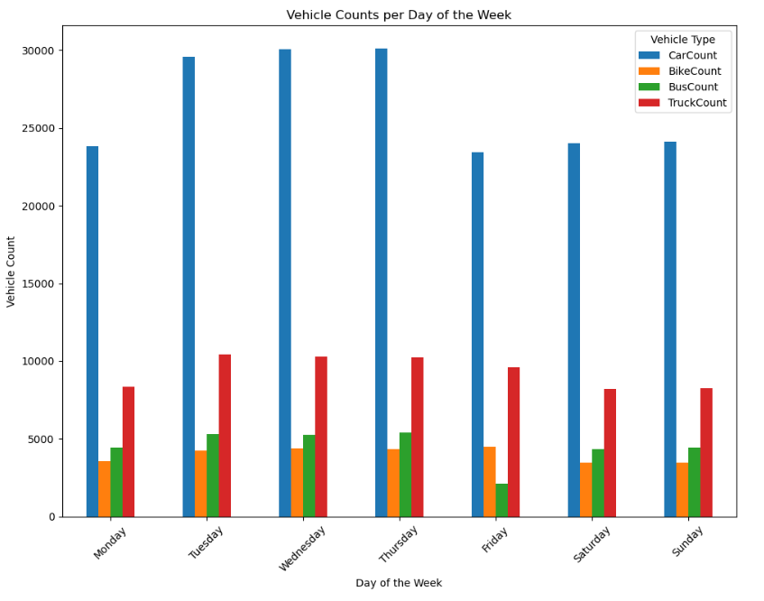
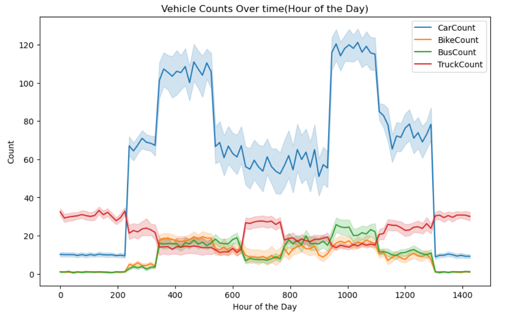

# 🚦 Traffic Flow Prediction System

A machine learning-powered web application that predicts traffic conditions based on real-time vehicle count data and time features.

## 📋 Table of Contents

- [Overview](#overview)
- [Features](#features)
- [Project Structure](#project-structure)
- [Installation](#installation)
- [Usage](#usage)
- [Model Performance](#model-performance)
- [Data Analysis & Insights](#data-analysis--insights)
- [Dataset](#dataset)
- [Technology Stack](#technology-stack)
- [Contributing](#contributing)
- [License](#license)

## 🎯 Overview

This project uses machine learning to classify traffic conditions into four categories:
- **🟢 Low**: Minimal traffic flow
- **🟡 Normal**: Regular traffic conditions
- **🟠 High**: Heavy traffic flow
- **🔴 Heavy**: Extremely congested conditions

The system analyzes vehicle counts (cars, bikes, buses, trucks) and time-based features to make accurate predictions using a Random Forest classifier.

## 📸 Application Interface



*The sleek, modern interface of the Traffic Situation Predictor with real-time prediction capabilities*

## ✨ Features

- **🎯 Real-time Prediction**: Instant traffic condition classification with one-click prediction
- **🎨 Beautiful Interface**: Modern, responsive design with stunning traffic-themed background
- **🚗 Multi-vehicle Analysis**: Separate input controls for cars, bikes, buses, and trucks
- **⏰ Time-based Controls**: Interactive hour and minute dropdown selectors
- **📊 Visual Results**: Clear prediction display with color-coded traffic status
- **🎛️ Intuitive Controls**: Easy-to-use increment/decrement buttons for vehicle counts
- **⚡ Fast Processing**: Instant predictions powered by pre-trained Random Forest model

## 📁 Project Structure

```
predict-traffic-flow/
├── 📁 src/                    # Source code
│   └── app.py                 # Streamlit web application
├── 📁 data/                   # Dataset files
│   └── TrafficDataset.csv     # Training data (2,976 records)
├── 📁 models/                 # Trained models
│   ├── rf_model.pkl           # Random Forest classifier
│   └── scaler.pkl             # Feature scaler
├── 📁 notebooks/              # Jupyter notebooks
│   └── Predict-traffic-flow.ipynb  # Data analysis & model training
├── 📁 docs/                   # Documentation
├── requirements.txt           # Python dependencies
├── README.md                  # Project documentation
└── .gitignore                 # Git ignore file
```

## 🚀 Installation

1. **Clone the repository:**
   ```bash
   git clone https://github.com/yourusername/predict-traffic-flow.git
   cd predict-traffic-flow
   ```

2. **Create a virtual environment:**
   ```bash
   python -m venv venv
   source venv/bin/activate  # On Windows: venv\Scripts\activate
   ```

3. **Install dependencies:**
   ```bash
   pip install -r requirements.txt
   ```

## 💻 Usage

### Running the Web Application

1. **Navigate to the src directory:**
   ```bash
   cd src
   ```

2. **Launch the Streamlit app:**
   ```bash
   streamlit run app.py
   ```

3. **Open your browser** and go to `http://localhost:8501`

### Using the Application

1. **📊 Enter Vehicle Counts:**
   - Use the **+/-** buttons or type directly to set:
     - Number of Cars (default: 100)
     - Number of Bikes (default: 70)
     - Number of Buses (default: 35)
     - Number of Trucks (default: 10)

2. **⏰ Configure Time Settings:**
   - Select **Hour** from dropdown (0-23)
   - Select **Minute** from dropdown (0-59)

3. **🎯 Get Prediction:**
   - Click the **"🚦 Predict Traffic Situation"** button
   - View the result in the green status bar showing predicted traffic condition

4. **📈 Interpret Results:**
   - **🟢 Low**: Minimal traffic flow
   - **🟡 Normal**: Regular traffic conditions  
   - **🟠 High**: Heavy traffic flow
   - **🔴 Heavy**: Extremely congested conditions

### Jupyter Notebook Analysis

Open the notebook for detailed data analysis and model training:
```bash
jupyter notebook notebooks/Predict-traffic-flow.ipynb
```

## 📊 Model Performance

- **Algorithm**: Random Forest Classifier
- **Features**: 5 input features (CarCount, BikeCount, BusCount, TruckCount, TimeInMins)
- **Classes**: 4 traffic categories (Low, Normal, High, Heavy)
- **Training Data**: 2,976 records with 15-minute intervals
- **Feature Scaling**: StandardScaler for numerical normalization

## 📈 Data Analysis & Insights

### Traffic Patterns by Time

*Average traffic distribution throughout the day showing peak hours and patterns*

### Vehicle Distribution Analysis

*Vehicle count patterns across different days of the week*

### Time Series Analysis

*Historical vehicle counts showing temporal trends and variations*

### Model Feature Importance

*Random Forest feature importance showing which factors most influence traffic predictions*

## 📈 Dataset

The `TrafficDataset.csv` contains:
- **Records**: 2,976 entries
- **Time Range**: Multiple days with 15-minute intervals
- **Features**:
  - Time, Date, Day of the week
  - CarCount, BikeCount, BusCount, TruckCount
  - Total vehicle count
  - Traffic Situation (target variable)

## 🛠️ Technology Stack

- **Frontend**: Streamlit
- **Backend**: Python
- **Machine Learning**: scikit-learn
- **Data Processing**: pandas, numpy
- **Model Persistence**: joblib
- **Development**: Jupyter Notebook

## 🔧 Dependencies

- streamlit
- numpy
- pandas
- scikit-learn
- joblib
- jupyter (for notebook analysis)

## 🤝 Contributing

1. Fork the repository
2. Create a feature branch (`git checkout -b feature/amazing-feature`)
3. Commit your changes (`git commit -m 'Add amazing feature'`)
4. Push to the branch (`git push origin feature/amazing-feature`)
5. Open a Pull Request

## 📝 License

This project is licensed under the MIT License - see the [LICENSE](LICENSE) file for details.

## 🙏 Acknowledgments

- Traffic data collection and preprocessing
- Machine learning model development
- Streamlit for the web interface framework
- Open source community for various libraries used

## 📞 Contact

email: raunaksinghkhalsa@gmail.com

---

**Made with ❤️ for better traffic management**